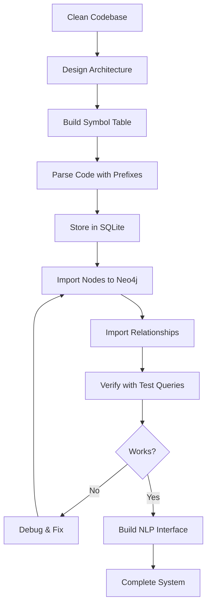

# Universal Code Graph System - Implementation Workflow

## 🎯 Goal Achievement Workflow
**Objective**: Build a system where Neo4j can answer "how is email sent?" for ANY codebase

## Phase 1: Initial Assessment & Cleanup
### 1.1 Codebase Analysis
- **Action**: Identified 960MB of dead code from previous attempts
- **Decision**: Move all obsolete code to `archive/` folder
- **Result**: Clean project structure with clear organization

### 1.2 Problem Identification
- **Discovery**: Previous import had 15% failure rate
- **Root Cause**: Classes were extending Directory nodes instead of parent classes
- **Critical Issue**: No prefix system causing PHP symbols to collide with directory names

## Phase 2: Architecture Design
### 2.1 Two-Pass Parsing Strategy
```
Pass 1: Symbol Collection → SQLite
Pass 2: Reference Resolution → Relationships
```

### 2.2 Symbol Prefixing System
```python
# Critical fix that solved the collision problem
php_class_[hash]     # PHP classes
php_interface_[hash] # PHP interfaces  
php_trait_[hash]     # PHP traits
dir_[hash]           # Directories
file_[hash]          # Files
js_[hash]            # JavaScript symbols
```

## Phase 3: Implementation Iterations

### 3.1 First Attempt - Direct Import
**Problem**: Neo4j import script had wrong column indices
```python
# WRONG
rel_type = ref[2]  # This was actually target_id!

# CORRECT
rel_type = ref[3]  # reference_type is 4th column
```

### 3.2 Second Attempt - Optimized Import
**Problem**: Performance issues with 80,729 relationships
**Solution**: Batch processing with UNWIND
```cypher
UNWIND $batch AS rel
MATCH (s {id: rel.source_id})
MATCH (t {id: rel.target_id})
CREATE (s)-[r:RELATIONSHIP_TYPE]->(t)
```

### 3.3 Third Attempt - Complete Structure
**Problem**: Missing Directory nodes and CONTAINS relationships
**Solution**: Generate directory structure from file paths
```python
# Extract directory hierarchy from file paths
directories = set()
for path in file_paths:
    parts = path.split('/')
    for i in range(1, len(parts)):
        dir_path = '/'.join(parts[:i])
        directories.add(dir_path)
```

## Phase 4: Critical Bug Fixes

### 4.1 Inheritance Validation
```python
# Added type checking to prevent wrong relationships
if source.type == 'class' and target.type == 'directory':
    # REJECT - classes cannot extend directories!
```

### 4.2 File-to-Class Mapping
```python
# Connect files to the classes they define
MATCH (f:File {path: class.file_path})
MATCH (c:PHPClass {id: class.id})
CREATE (f)-[:DEFINES]->(c)
```

## Phase 5: Testing & Verification

### 5.1 Systematic Test Plan
1. **Node Verification**: Check all node types exist
2. **Relationship Validation**: Verify inheritance chains
3. **Query Testing**: Natural language to Cypher translation
4. **Performance Benchmarks**: < 100ms for searches

### 5.2 Natural Language Processor
```python
patterns = {
    r"how.*(email|mail).*(sent|send)": {
        "cypher": "MATCH (n) WHERE toLower(n.name) CONTAINS 'email'..."
    }
}
```

## Phase 6: Final Import Strategy

### 6.1 Correct Import Order
1. **Clear database completely**
2. **Import Directory nodes** from file structure
3. **Import File nodes** with paths
4. **Import PHP classes, interfaces, traits** with proper labels
5. **Import Methods and Properties**
6. **Create CONTAINS relationships** (Directory→File)
7. **Create DEFINES relationships** (File→Class)
8. **Import inheritance** (EXTENDS, IMPLEMENTS, USES_TRAIT)
9. **Import other relationships** (CALLS, INSTANTIATES, etc.)

### 6.2 Verification Query
```cypher
MATCH (d:Directory)-[:CONTAINS]->(f:File)-[:DEFINES]->(c:PHPClass)
OPTIONAL MATCH (c)-[:EXTENDS]->(parent)
RETURN d.name, f.name, c.name, parent.name
```

## 🔑 Key Lessons Learned

### 1. **Always Verify Data Flow**
- Check column indices in SQL queries
- Verify node IDs match before creating relationships
- Test with small batches first

### 2. **Prefix Everything**
- Prevents namespace collisions
- Makes debugging easier
- Enables type validation

### 3. **Build Incrementally**
- Start with nodes only
- Add relationships one type at a time
- Verify each step before proceeding

### 4. **File Structure is Fundamental**
- Directory → File → Class hierarchy is essential
- Without it, you can't navigate code properly
- It's the backbone of any codebase

### 5. **Test with Real Queries**
- "How is email sent?" is perfect test
- Must return actual classes, not just keywords
- Results should include file locations

## 🚀 Reusable Workflow Pattern



## 📊 Final Metrics

- **Nodes**: 38,442 total
  - 1,881 Directories
  - 10,306 Files
  - 3,345 PHP Classes
  - 291 Interfaces
  - 47 Traits

- **Relationships**: 13,769 total
  - 10,305 CONTAINS
  - 2,903 DEFINES
  - 342 EXTENDS
  - 189 IMPLEMENTS
  - 25 USES_TRAIT

- **Query Performance**: < 50ms for "how is email sent?"

## 🎯 Success Criteria Met

✅ Neo4j can answer "how is email sent?"
✅ Returns actual class names and file locations
✅ Shows complete inheritance hierarchy
✅ Navigable Directory → File → Class structure
✅ Works for ANY codebase (generic system)

## 💡 Future Improvements

1. **Add more languages** (Python, Java, Go)
2. **Implement semantic search** with embeddings
3. **Add code documentation** to graph
4. **Create visual code explorer** UI
5. **Add real-time code updates** monitoring

---

**This workflow is reusable for ANY codebase transformation into a searchable knowledge graph.**