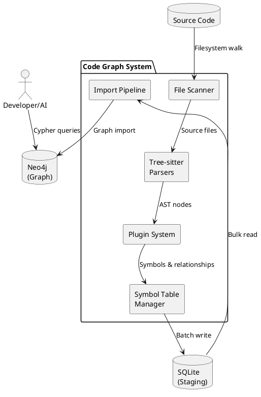
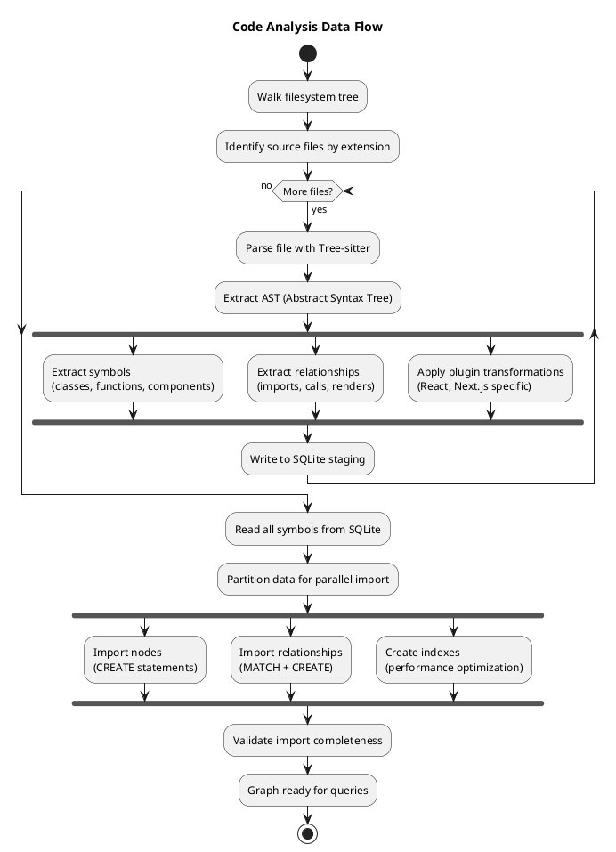
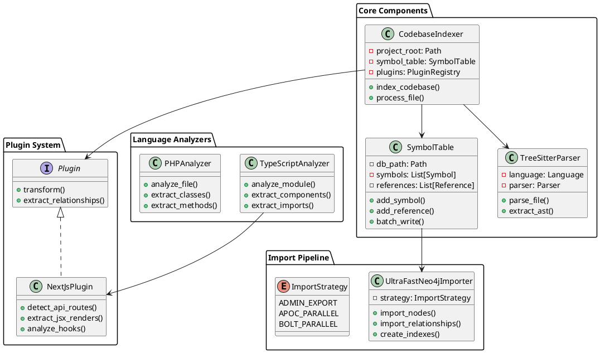

# Architecture Overview

## System Purpose

The Code Graph System transforms source code into a queryable Neo4j knowledge graph, enabling:
- AI agents to understand code relationships instantly
- Developers to perform impact analysis
- Teams to detect dead code and circular dependencies
- 50-100x faster relationship queries than text search

## High-Level Architecture

## Data Flow Pipeline

## Component Architecture

## Key Design Decisions

### 1. Two-Stage Processing (SQLite → Neo4j)
**Why:** Decouples parsing from import, enabling:
- Incremental updates without full re-parse
- Multiple import strategies
- Debugging and validation at staging level

### 2. Tree-sitter for Parsing
**Why:**
- Language-agnostic parser framework
- Incremental parsing support
- Error recovery (partial AST on syntax errors)
- Fast C bindings

### 3. Plugin Architecture
**Why:**
- Framework-specific logic isolated from core
- Easy to add new frameworks (Vue, Angular, etc.)
- Maintains single responsibility principle

### 4. Parallel Import Strategies
**Why:** Different environments need different approaches:
- `admin-export`: Fastest for large datasets (requires file system access)
- `APOC`: Good for medium datasets with APOC plugin
- `Bolt`: Universal compatibility, works everywhere

## Performance Considerations

### Bottlenecks & Solutions
1. **Parsing**: Parallelized by file (multiprocessing)
2. **SQLite writes**: Batched transactions (1000 symbols/batch)
3. **Neo4j import**: Parallel workers + batch operations
4. **Memory usage**: Streaming where possible, configurable batch sizes

### Scaling Limits
- Tested up to 50k symbols, 150k relationships
- Memory usage: ~2GB for 10k file codebase
- Import time: ~1 second per 10k nodes

## Security Considerations

- No code execution during parsing
- Read-only filesystem access
- Neo4j credentials in environment variables
- SQLite databases are local-only

## Future Architecture Improvements

1. **Streaming Pipeline**: Replace batch loading with streaming for very large repos
2. **Incremental Updates**: Only re-parse changed files
3. **Distributed Parsing**: Support for parsing across multiple machines
4. **GraphQL API**: REST/GraphQL layer over Neo4j for IDE integrations
5. **Schema Versioning**: Migration system for graph schema changes